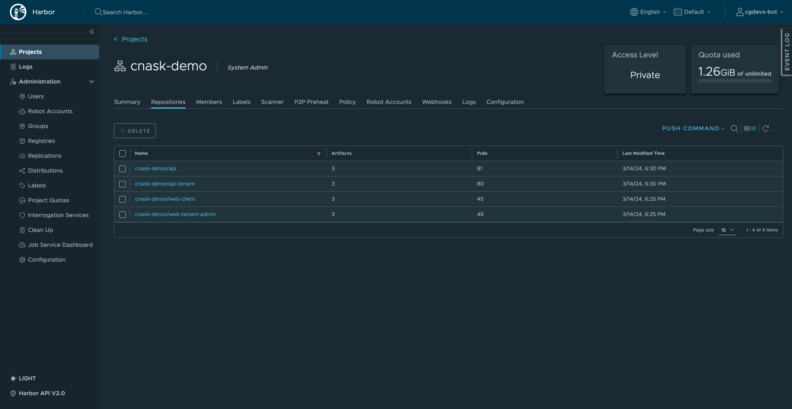
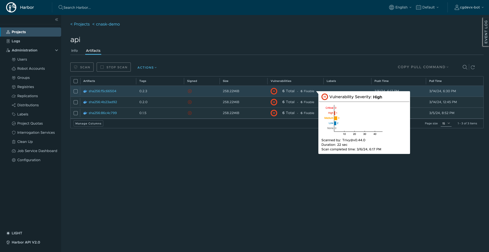

CG DevX reference implementation provides image and helm chart repository capabilities using Harbor.

To access Harbor, follow the link in platform GitOps repository readme file (`README.md`),
or provided by operators (AKA a platform team).
Harbor is configured to use Vault as OIDC provider and will automatically redirect you to Vault login page,
which will look like this

Each workload in CG DevX has a project in Harbor associated with it.
A project contains all repositories of a workload.
Control (RBAC) is applied to projects, so that only user of a specific team could access it.

Delivery pipelines provided by CG DevX are pre-configured to work with registry.

Also, registry provides static analysis of vulnerabilities in images through the integration with Aqua Security Trivy.

