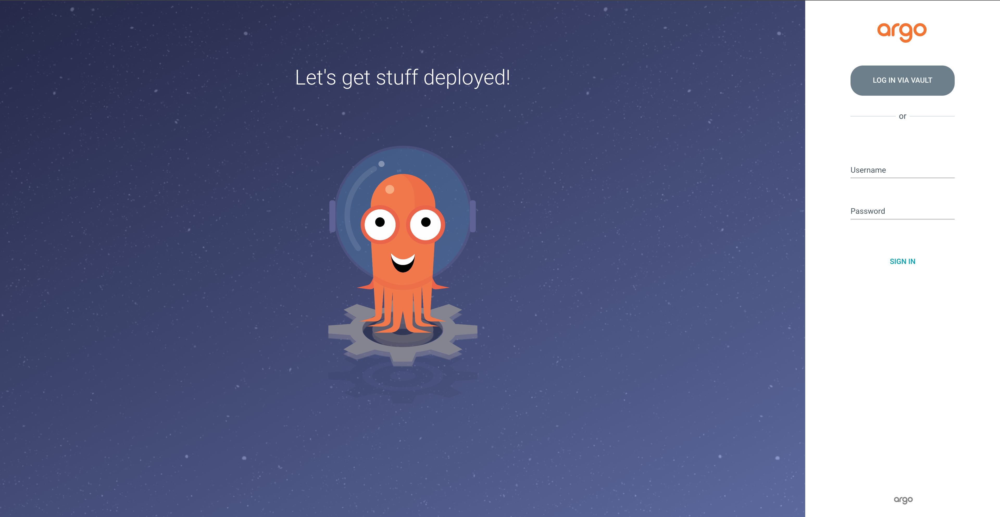
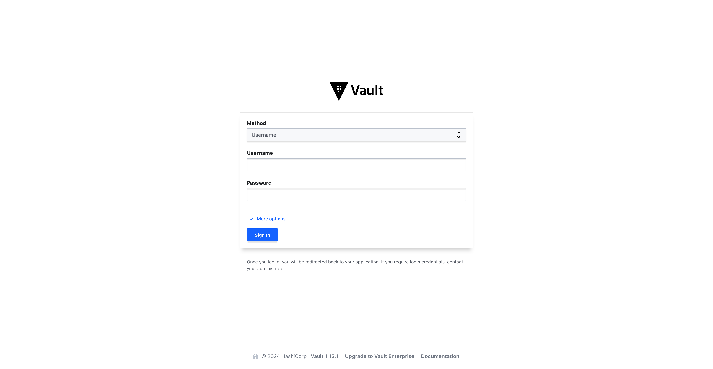
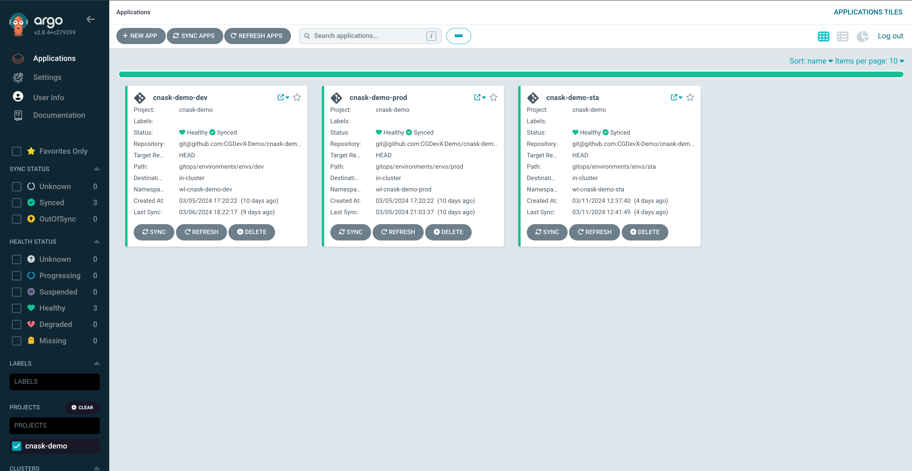
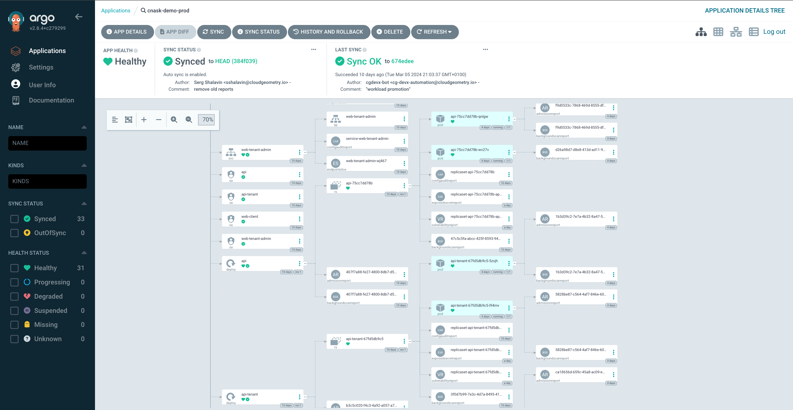
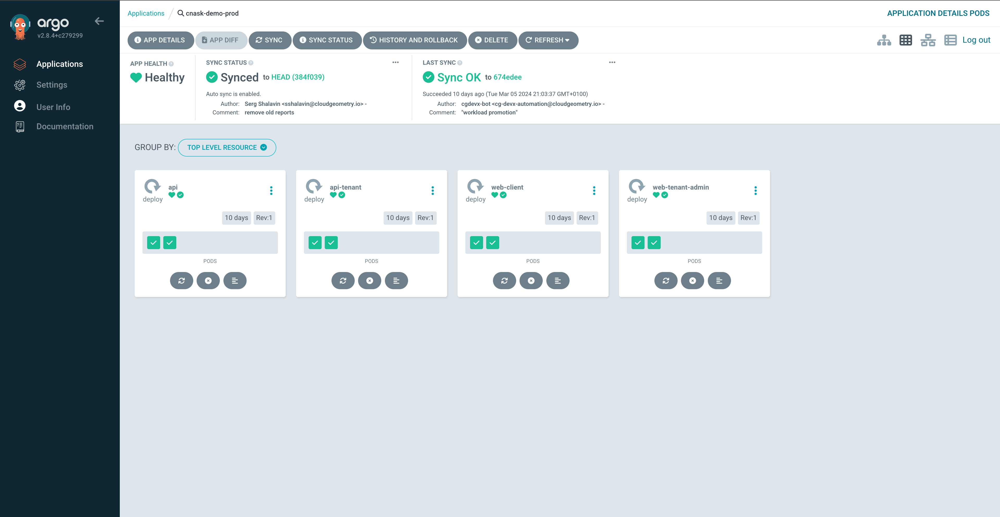
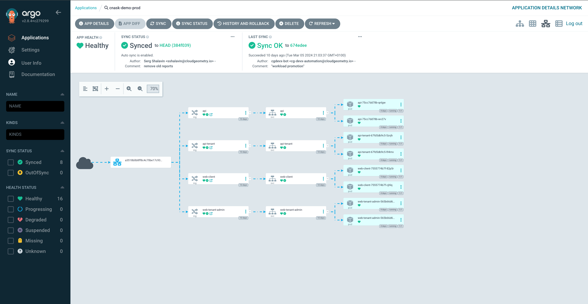

The CG DevX reference implementation provides continuous delivery using a tool called ArgoCD.

ArgoCD is K8s and GitOps centric, and provides detailed visualization.
To access ArgoCD, follow the link in the platform GitOps repository readme file (`README.md`),
or provided by operators (AKA a platform team).

ArgoCD is configured to use Vault as its OIDC provider.

You will need to press the `Log in via Vault` button, which will redirect you to Vault login page,
which will look like this:

<!-- All images on this page can probably be re-shot with a tighter viewport so that the text is larger. -->

CG DevX creates one project per workload and applies RBAC to limit access to workload dashboards and management.

All workload environments will be listed on the ArgoCD project page.

ArgoCD also provides a detailed view of all K8s resources associated with a workload,
statistics on the pod and node level, and ingress configuration.

