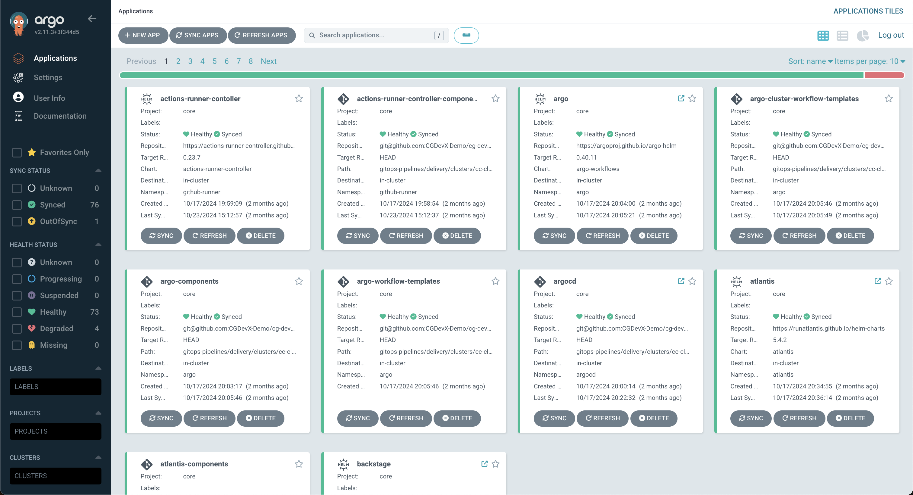
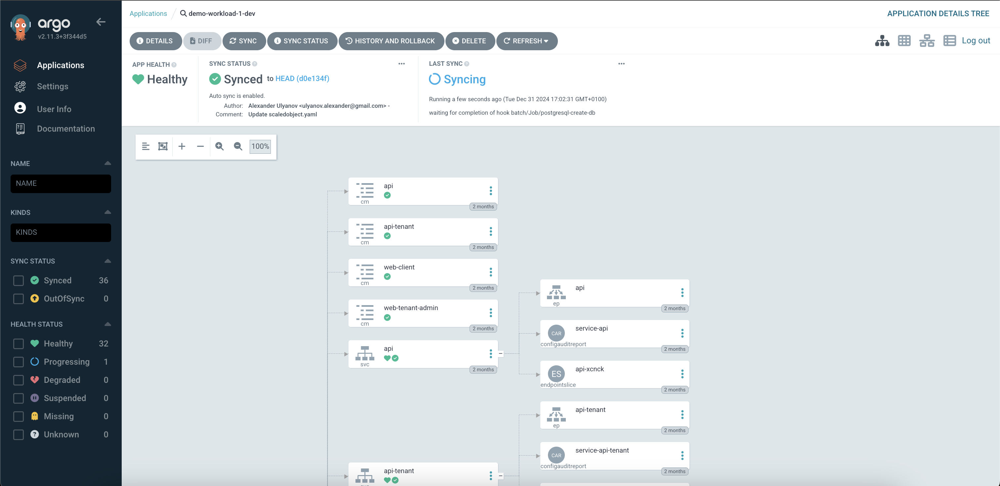

# Continuous Delivery with ArgoCD

The CG DevX reference implementation provides continuous delivery using a tool called ArgoCD. ArgoCD is a declarative, GitOps-based continuous delivery tool for Kubernetes applications. This guide provides a beginner-friendly walkthrough on how to work with ArgoCD to manage application deployments in CGDevX.

## Overview

ArgoCD integrates seamlessly with CGDevX to automate the deployment and synchronization of Kubernetes applications. It continuously monitors the **GitOps Repository** for changes and updates your cluster automatically. This guide will help you:

- Understand ArgoCD's core concepts.
- Learn how to navigate the ArgoCD UI.
- Deploy, monitor, and troubleshoot applications using ArgoCD.

## Core Concepts

Before diving in, it’s essential to understand the following concepts:

### **Application**
An ArgoCD **Application** represents a deployed Kubernetes workload. It maps to a specific directory in your **GitOps Repository**, containing manifests that define the desired state of your application.

### **GitOps Repository**
The GitOps repository stores Kubernetes manifests, ArgoCD application configurations, and Terraform setups. These files define your workload and its infrastructure.

### **Sync**
The process of aligning the desired state (as defined in the GitOps Repository) with the live state in the Kubernetes cluster.

## Setting Up ArgoCD for Your Workload

### 1. **Accessing the ArgoCD Dashboard**

To access ArgoCD, follow the link in the platform GitOps repository readme file (`README.md`),
or provided by operators (AKA a platform team).

ArgoCD is configured to use Vault as its OIDC provider.

You will need to press the Log in via Vault button, which will redirect you to Vault login page. Log in using the credentials (username/password or token) given to you by your platform operator.

Once logged in, you’ll see a list of existing ArgoCD applications.

CG DevX creates one project per workload and applies RBAC to limit access to workload dashboards and management. All workload environments will be listed on the ArgoCD project page.

ArgoCD also provides a detailed view of all K8s resources associated with a workload,
statistics on the pod and node level, and ingress configuration.

### 2. **Deploying an Application**

ArgoCD automatically detects and deploys applications defined in the GitOps Repository. To deploy a workload:

1. Add the necessary Kubernetes manifests for your application to the GitOps Repository.
2. Commit and push the changes.

ArgoCD will automatically sync the changes and deploy the application to your cluster.  

### 3. **Syncing Your Application**

ArgoCD will continuously monitor the GitOps Repository, but you can also trigger a manual sync:

1. In the ArgoCD dashboard, find your application.
2. Click **Sync** to align the live state with the desired state from the GitOps Repository.
3. Monitor the sync process and confirm successful deployment.  

   

## Additional Resources

- [Official ArgoCD Documentation](https://argo-cd.readthedocs.io/)
- [Kubernetes Getting Started Guide](https://kubernetes.io/docs/tutorials/kubernetes-basics/)
- [Debugging Kubernetes Deployments](https://kubernetes.io/docs/tasks/debug/)

