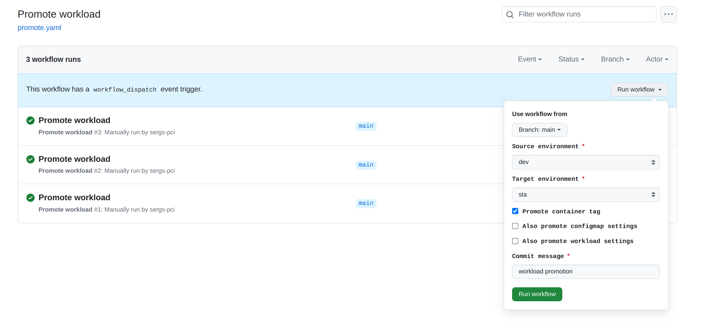

The CG DevX provides workload promotion as a part of workload GitOps repository. Promotion is done using a combination
of Git provider native workflow and Argo Workflow. 

Argo Workflow provides platform wide workflow templates, detailed visualization of the process, integrated with secret management, and scoped down to a workload.
To access Argo Workflow, follow the link in the platform GitOps repository readme file (`README.md`),
or provided by operators (AKA a platform team).

Argo Workflow is configured to use Vault as its OIDC provider.

CG DevX also provides templates to use only Git provider for
promotions.

```shell
.
├── .argo
│   └── promote-wf.yaml
├── .github
│   ├── terraform.yaml
│   └── workflows
│       ├── promote_gha_only.yaml_gha
│       └── promote.yaml
...
```

Promotion is done by copying of manifest files from source to target environment. For more details please
see [workload environment modeling](../workloads/gitops_environments.md)

Source and target environment definitions could be extended by updating `promote.yaml` workflow. Options should map to
your environment names (folder names), or you could implement additional transformer.

```yaml
---
# Promote a GitOps workload from one environment to the next
name: Promote workload
# Controls when the workflow will run
on:
  # Allows you to run this workflow manually from the Actions tab
  workflow_dispatch:
    inputs:
      source_env:
        description: Source environment
        required: true
        default: dev
        type: choice
        options: [ <your environment folder names> ]
      target_env:
        description: Target environment
        required: true
        default: sta
        type: choice
        options: [ <your environment folder names> ]
...
```


