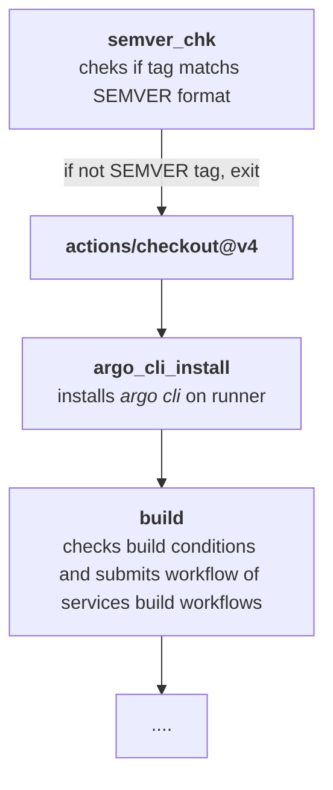

# Github Action Workflow Structure
CI Github Action start is triggered by push new tag to the workload repo. 
All the CI chain elements run from the steps of job `multi_service_parallel_build` described in `multi_service_parallel_build.yml`. If one of the steps fails, the Github action fails completely. Some steps are simple bash executed on the runner, another are submissions of relatively complex argo workflows. The workflow structure is linear:  steps are executed one after another. 

