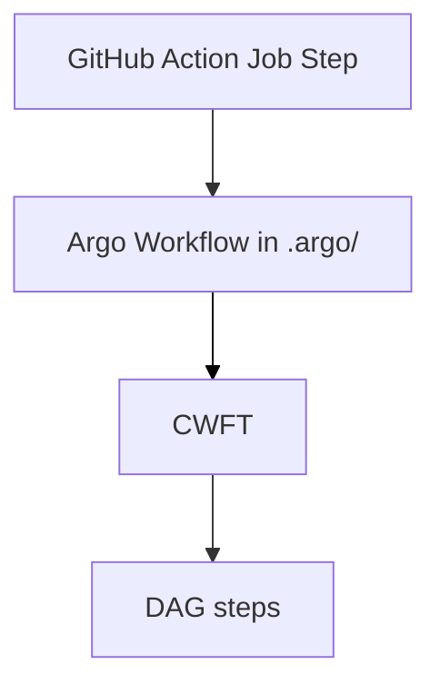

# Argo workflows: basic flows and templates

CG DevX leverages **Argo Workflows** to streamline CI/CD processes. Workflows defined in the `.argo` directory of your workload repository.
These workflows rely on pre-configured **Cluster Workflow Templates (CWFTs)** to perform specific actions, ensuring efficiency and consistency across all workloads.

CG DEVX's argo workflows approach implements following execution scheme:

&nbsp;

## How It Works

1. **GitHub Actions Job**: When triggered, a step from your GitHub Actions job submits an Argo Workflow.

2. **Argo Workflow Submission**: The Argo Workflow acts as orchestrator, submitting tasks to CWFTs.

3. **Cluster Workflow Templates (CWFTs)**  
   Cluster Workflow Templates (CWFTs) are reusable building blocks that execute individual tasks, such as building images or scanning code. They are centrally defined and shared across workloads.

4. **DAG Steps**  
   Some CWFTs, like _build_chain_p_cwft_, use a Directed Acyclic Graph (DAG) to handle tasks with dependencies, allowing for parallel execution wherever possible.

## Basic Workflows

The `.argo` directory in your workload repository contains workflows for common CI/CD tasks:

- **build-wow-wf**  
   Handles building, linting, and running quality checks to prepare your workload for deployment.

- **crane-p-wf**  
   Pushes successfully built Docker images to the Harbor container registry.

- **crane-img-tag-wf**  
   Updates tags for unchanged services to keep their versions aligned with the new ones.

- **version_changer-wf**  
   Updates the `version.yaml` file in the GitOps repository with the latest versions for deployment.

## Key Cluster Workflow Templates

- **build_chain_p_cwft**  
   Orchestrates the build process through a series of steps:
   - **megalinter-cwft**: Lints the code to ensure it meets quality standards.
   - **trivy-fs-s3-cwft**: Scans the filesystem for vulnerabilities.
   - **kaniko-s3-p-cwft**: Builds container tar-images with Kaniko and puts them to the S3.

- **crane-s3-p-cwft**  
   Tags and pushes built images from S3 to the Harbor container registry.

- **crane-img-tag-cwft**  
   Updates tags for unchanged services to keep them consistent with updated ones.

- **version-changer-cwft**  
   Updates the `version.yaml` file in the GitOps repository to reference the latest image versions.

 
