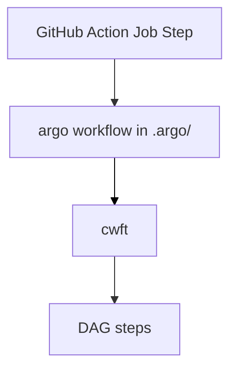

# Argo workflows: basic flows and templates

CG DEVX's argo workflows approach implements following execution scheme:

&nbsp;

## Basic workflows

- **build**, which includes *build*, *lint* and *check* steps
- **registry_put** places successfully builded image into the Harbor image repository
- **crane_img_tag** tags images for unchanged services in the same *apps* structure
- **version_change** promotes version in the version.yaml file in workload's gitops-repo.

## Cluster workflow templates

For every action workflows use cluster workflow templates consist of one or several steps to perform.
In case of a list of parameters to process templates from clusterworkflow templates can be called iteratively.
Cluster workflow templates are used to implement atomic phases of services images build process,
except  `build_chain_p_cwft`, which have a DAG inside and called in a special way: inside so-called
workflow-of-workflows structure in `.argo/build-wow-wf.yaml`.

- build_chain_p_cwft
    - megalinter-cwft — lints service code using Megalinter
    - trivy-fs-s3-cwft — checks service fs with Trivy
    - kaniko-s3-p-cwft — builds tar-image with Kaniko
- crane-s3-p-cwft — tags and puts image into the Harbor image repo
- crane-img-tag-cwft — tags unchanged (if any) services latest images and tag it with the same tag as changed
- version-changer-cwft — change version in version.yaml in gitops-repo
     
