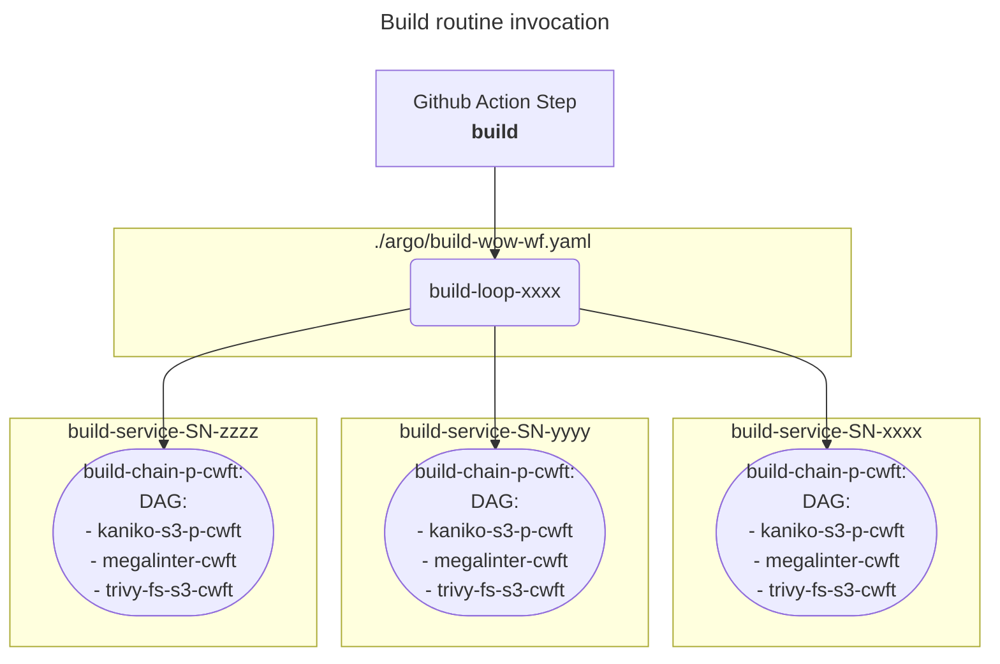

# Build routine execution
GHA workflow's step build is used to submit the argo workflow build-loop-xxxx (-xxxx and similar parts of workload names here and further are auto-generated), which in it's turn generate series of workflows (one for each service) based on build-chain-p-cwft clusterworkflow template. build-chain-p-cwft has DAG workflow structure and run templates from these [clusterworkflow templates](https://argo-workflows.readthedocs.io/en/latest/cluster-workflow-templates/):

- kaniko-s3-p-cwft
- megalinter-cwft
- trivy-fs-s3-cwft

for [kaniko](kaniko_build.md), [megalinter](megalinter.md) and [trivy](trivy.md) rescpectively. All the workflow parameters, once calculated in [Github Action workflow](github_action_workflow.md), are translated inside argo workflows templates structures sequentially.

