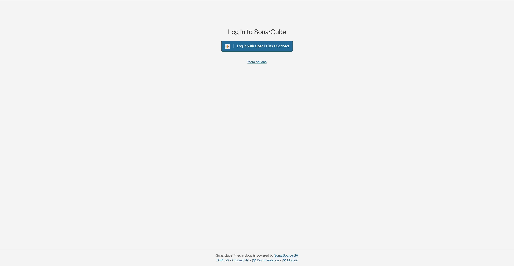
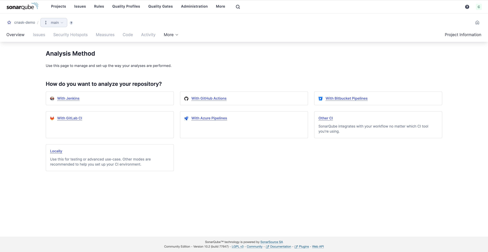

The CG DevX reference implementation provides static code analysis capabilities using SonarQube.

To access SonarQube, follow the link in the platform GitOps repository readme file (`README.md`),
or provided by operators (AKA a platform team).

SonarQube is configured to use Vault as its OIDC provider.

<!-- Images on this page need cropping -->

You need to press the `Login with OpenID SSO Connect` button, which will redirect you to the Vault login page,
which will look like this:

Each workload in CG DevX has a project in SonarQube associated with it.
Control (RBAC) is applied to projects, so that only users that belong to a specific team can access it.

CG DevX delivery pipelines are pre-configured to work with SonarQube.
However, as SonarQube rules are language-specific, they should be configured by the team working with the workload.
