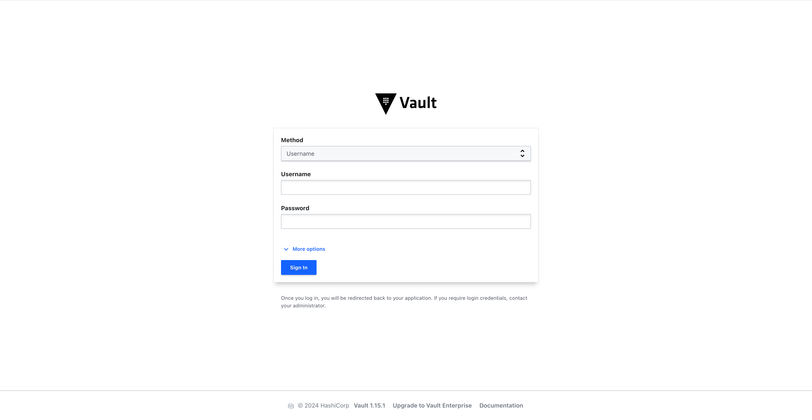

CG DevX reference implementation provides static code analysis capabilities using SonarQube.

To access SonarQube, follow the link in platform GitOps repository readme file (`README.md`),
or provided by operators (AKA a platform team).

SonarQube is configured to use Vault as OIDC provider.

You need to press `Login with OpenID SSO Connect` button which will redirect you to Vault login page,
which will look like this

Each workload in CG DevX has a project in SonarQube associated with it.
Control (RBAC) is applied to projects, so that only user of a specific team could access it.

CG DevX delivery pipelines are pre-configured to work with SonarQube,
however, as SonarQube rules are language-specific, they should be configured by the team working with workload.
