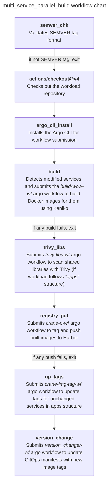

# Github Action Workflow Structure

The **multi_service_parallel_build** GA workflow in CG DevX automates the process of building, testing, and pushing container images for your workload. It is designed to handle multiple services efficiently, making it ideal for microservices architectures.

## What Does This Workflow Do?

The workflow focuses on the following tasks:

1. **Build Container Images**: Builds Docker images for all changed services in your repository.
2. **Push to Container Registry**: Uploads the built images to the Harbor container registry for deployment.
3. **Update GitOps Repository**: Updates deployment manifests in the GitOps repository to reflect new image versions.

## How Is It Triggered?

The workflow starts automatically when a tag is pushed. For example, pushing a tag like `v1.0.0` to your workload repository triggers the workflow.

## Key Steps

All the CI chain elements run as part of the job `multi_service_parallel_build`, described in the `multi_service_parallel_build.yml` file located in the `.github/workflows` directory of your workload repository.

If any step fails, the entire GitHub Action fails. Some steps are simple bash scripts executed on the runner, while others involve submitting more complex workflows to Argo Workflows. You can find these workflows in `.argo` directory of your workload repository.

The workflow follows a linear structure: steps are executed sequentially, one after another.

## Core Tools

- **Kaniko**: Used for building container images directly in the CI environment without requiring a local Docker daemon. Learn more about Kaniko workflow [here](kaniko_build.md).
- **Trivy**: A security scanner that detects vulnerabilities in shared libraries. Learn more about Trivy workflow [here](trivy.md).
- **Harbor**: A container image registry where built images are stored for deployment. Learn more about Harbor registry [here](../artifacts/registry.md).

## Monitoring the Workflow

You can monitor the status of builds and workflows:

1. **GitHub Actions UI**: Provides logs for each step in the workflow.
2. **Argo Workflows Dashboard**: Displays the status of submitted workflows and provides detailed logs.

## Example Flow

1. A developer pushes the tag `1.0.0` to the repository.
2. The workflow detects changes in `wl-service-name/src/` directory.
3. Docker image for `wl-service-name:1.0.0` is built and pushed to the registry.
4. The GitOps repository `version.yaml` manifest is updated to reference the new image version.
