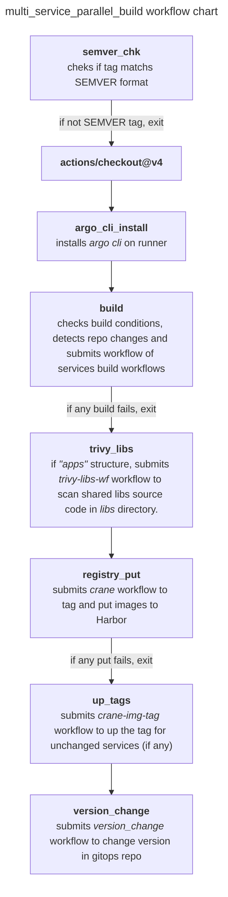

# Github Action Workflow Structure

The **Multi-Service Parallel Build** workflow in CGDevX automates the process of building, testing, and pushing container images for your workload. It is designed to handle multiple services efficiently, making it ideal for microservices architectures.

## What Does This Workflow Do?

The workflow focuses on the following tasks:

1. **Build Container Images**: Builds Docker images for all changed services in your repository.
2. **Push to Container Registry**: Uploads the built images to the Harbor container registry for deployment.
3. **Run Security Scans**: Optionally scans shared libraries for vulnerabilities using Trivy.
4. **Update GitOps Repository**: Updates deployment manifests in the GitOps repository to reflect new image versions.

## How Is It Triggered?

The workflow starts automatically when a tag is pushed. For example, pushing a tag like `v1.0.0` to your workload repository triggers the workflow.

## How Does It Work?

Here’s a high-level overview of what happens when the workflow runs:

1. **Check the Tag**: Validates the pushed tag to ensure it follows semantic versioning (e.g., `v1.0.0`).
2. **Detect Changed Services**: Compares the current and previous tags to identify services that have changed.
3. **Build and Push Images**:
   - Builds Docker images for the changed services using Kaniko.
   - Pushes the images to the Harbor container registry with the specified version tag.
4. **Run Trivy Scans** (Optional): If shared libraries are used, scans them for vulnerabilities.
5. **Update GitOps Repository**: Updates Kubernetes manifests in the GitOps repository to use the new image versions.

## Key Steps

All the CI chain elements run as part of the job `multi_service_parallel_build`, described in the `multi_service_parallel_build.yml` file located in the `.github/workflows` directory of your workload repository.

If any step fails, the entire GitHub Action fails. Some steps are simple bash scripts executed on the runner, while others involve submitting more complex workflows to Argo Workflows.

The workflow follows a linear structure: steps are executed sequentially, one after another.

## Core Tools

- **Kaniko**: Used for building container images directly in the CI environment without requiring a local Docker daemon. Learn more [here](https://cloudgeometry.github.io/cg-devx-docs/developers_guide/ci/kaniko_build/).
- **Trivy**: A security scanner that detects vulnerabilities in shared libraries (if applicable). Learn more [here](https://cloudgeometry.github.io/cg-devx-docs/developers_guide/ci/trivy/).
- **Harbor**: A container image registry where built images are stored for deployment. Learn more [here](https://cloudgeometry.github.io/cg-devx-docs/developers_guide/artifacts/registry/).

## Monitoring the Workflow

You can monitor the status of builds and workflows:

1. **GitHub Actions UI**: Provides logs for each step in the workflow.
2. **Argo Workflows Dashboard**: Displays the status of submitted workflows and provides detailed logs.

## Example Flow

1. A developer pushes the tag `1.0.0` to the repository.
2. The workflow detects changes in `wl-service-name/src/` directory.
3. Docker image for `wl-service-name:1.0.0` is built and pushed to the registry.
4. The GitOps repository `version.yaml` manifest is updated to reference the new image version.
