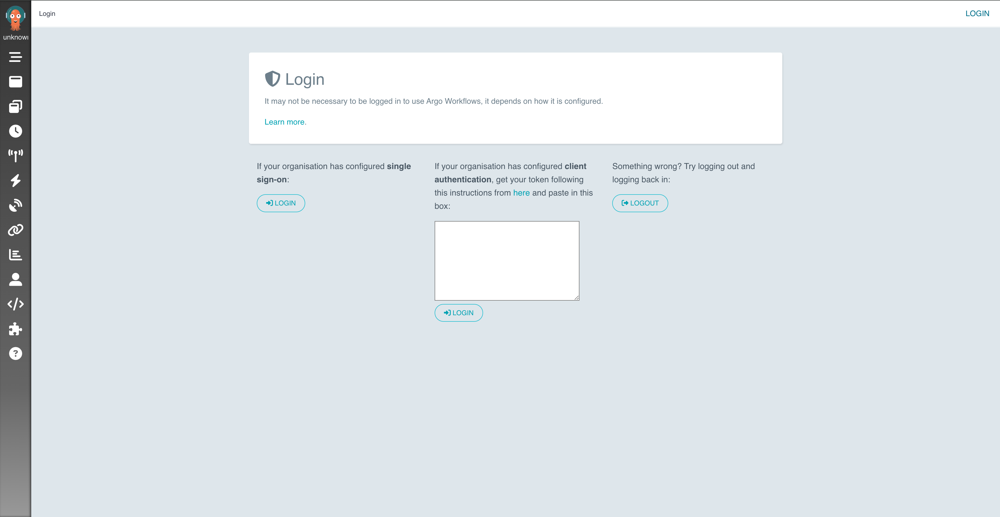

The CG DevX reference implementation provides continuous integration capabilities
using Git native pipelines (GitHub Actions, GitLab Pipelines), and ArgoWorkflow.

ArgoWorkflow is used to integrate natively with K8s services.

To access ArgoWorkflow, follow the link in the platform GitOps repository readme file (`README.md`),
or provided by operators (AKA a platform team).

ArgoWorkflow is configured to use Vault as OIDC provider.

<!-- Images on this page should be reshot with larger text. -->

You need to press the `Login` button on the left side of the page, which will redirect you to the Vault login page,
which will look like this:

Each workload in CG DevX has a namespace in ArgoWorkflow associated with it.
Control (RBAC) is applied to projects, so that only users of a specific team can access it.

<!-- IMAGE MISSING   -->

CG DevX ArgoWorkflow pipelines are pre-configured to work with static code analysis tools,
linters, security scanners, and image registries.
They also use automated cleanup to remove old artifacts.
