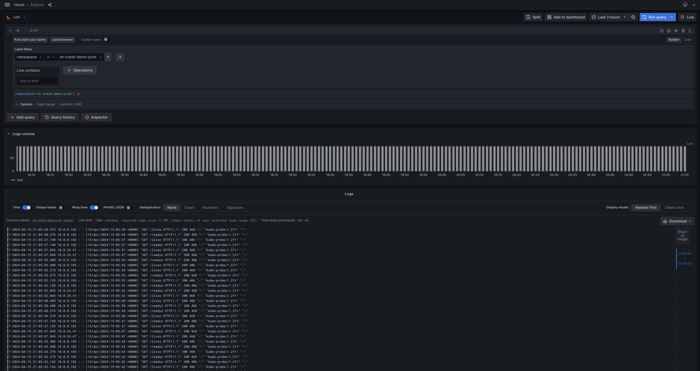

Default log management implementation is based on Grafana [Loki](https://github.com/grafana/loki).
Loki is by design optimized to work with K8s pod logs. It allows you to seamlessly switch between metrics and logs using
the same labels greatly improving user experience. Loki is integrated with Grafana used for monitoring, and Grafana is
used as default user interface to query logs.

Log data visualization is done using Grafana. You could browse data by navigating to Grafana => Explore, and pick Loki
as Datasource.

