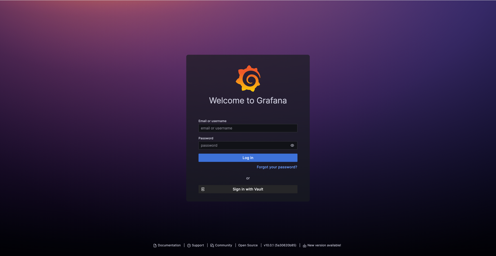

The CG DevX reference implementation provides monitoring and log management capabilities using Grafana, Prometheus, and
Loki.

Grafana serves as a visualization tool for both metrics and logs.
To access Grafana, follow the link in the platform GitOps repository readme file (`README.md`),
or provided by operators (AKA a platform team).

Grafana is configured to use Vault as its OIDC provider.
<!-- Images need to be cropped -->

You need to press the `Sign in with Vault` button, which will redirect you to the Vault login page,
which will look like this:

Control (RBAC) is applied to limit access to workload dashboards.

CG DevX has pre-installed K8s specific [dashboards](dashboards.md),
plus language- / framework-specific [dashboards](dashboards.md) that can be used as templates when creating a
workload-specific dashboard.
