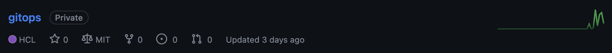
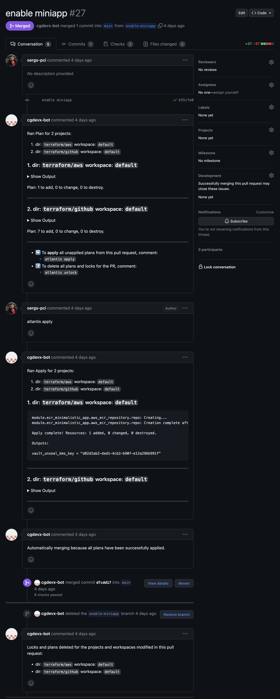
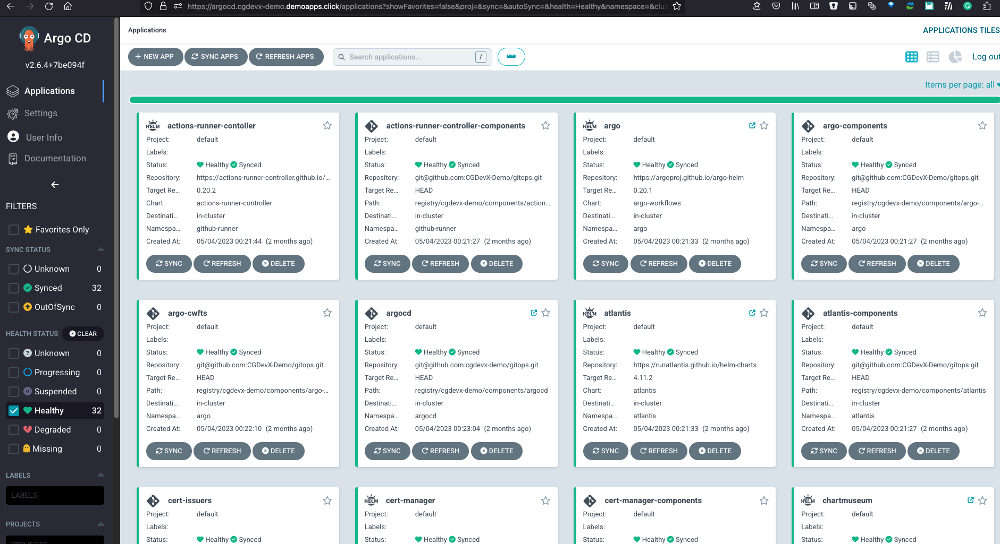
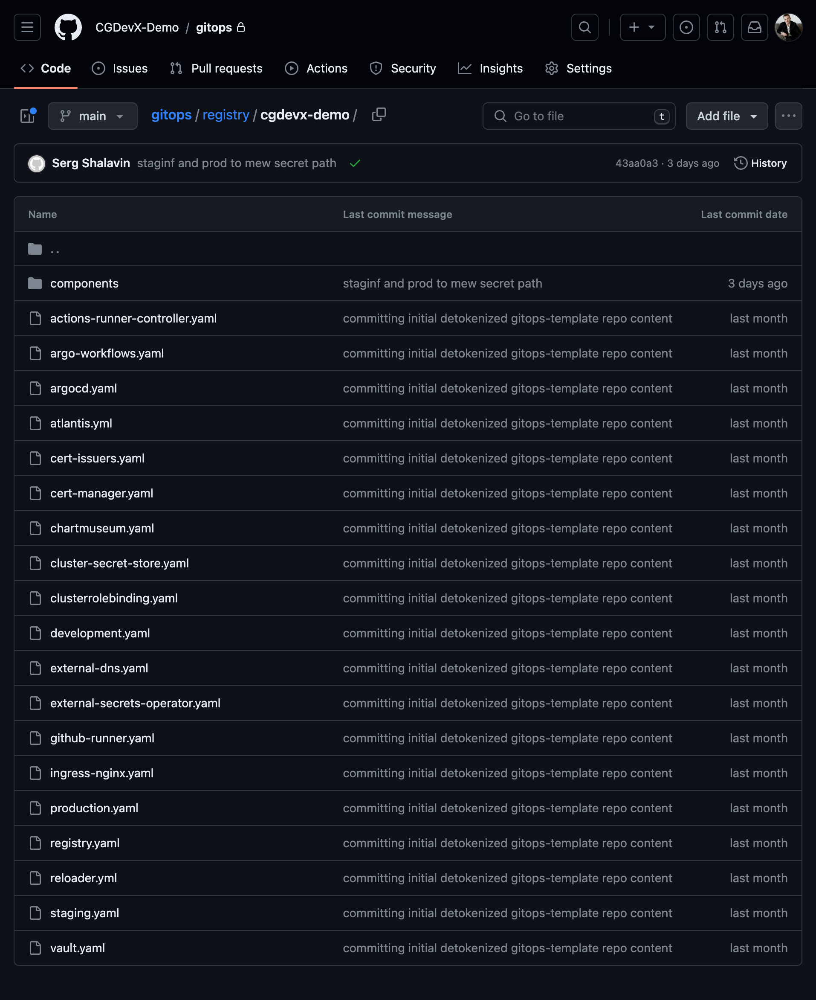

#Getting started

Welcome to the CGDevX Installation Guide! This guide will walk you through the process of installing CGDevX, a powerful platform that simplifies application management in Cloud Native and Cloud Agnostic environments. By following these steps, you'll be able to set up CGDevX and leverage its capabilities to build, deploy, and operate your services.

## Introduction

CGDevX simplifies the management of Cloud Native and Cloud Agnostic runtime environments. By following the CGDevX Golden Path, you can optimize your application development and deployment processes, enhance observability, ensure compliance, and embrace DevSecOps practices.

## Prerequisites

Before you begin the installation, ensure that you have the following prerequisites:

- Access to a supported cloud provider (e.g., AWS, Google Cloud, Azure)
- Administrative privileges to create and manage resources in the cloud environment
- Basic knowledge of cloud services and concepts
- Git client installed on your local machine

## Step 1: Prerequisites for the Infrastructure

1. Start by setting up an account with your preferred cloud provider if you haven't done so already:
	- [Prepare an AWS account](account_setup/aws_account_setup.md)

## Step 2: Installing CGDevX Core Components


Before getting started with CGDevX on your local machine, ensure that you have the necessary prerequisites installed. The following steps outline the installation process:

### macOS (using Homebrew)

If you are using macOS and have Homebrew installed, you can install the CGDevX CLI by running the following command:

```bash
brew install cgdevx/cli/cgdevx
```

To upgrade an existing CGDevX CLI installation to the latest version, run:

```bash
brew update
brew upgrade cgdevx
```

### Other Operating Systems

For installation on different operating systems, architectures, or containerized environments, please refer to the [CGDevX Installation README]() for detailed instructions.

## Step 3:  Create Your New CGDevX Cluster

To create a new CGDevX cluster, you need to provide a YAML configuration file with the required input parameters. Follow these steps:

**Create Cluster Configuration YAML**: Create a YAML file, e.g., `config.yaml`, and define the configuration for your cluster. Below is an example of a cluster configuration with the required input parameters:

```yaml
apiVersion: cgdevx.io/v1alpha1
kind: Cluster
metadata:
  name: my-cluster
spec:
  email: your-email@example.com
  cloud: aws
  cloudRegion: us-west-2
  clusterName: my-cluster
  gitOrg: your-github-organization-name
  dnsRegistrar: my-dns-registrar
  domainName: your-domain.com
  gitAccessToken: your-git-access-token
```

Adjust the values in the YAML file according to your specific environment and preferences. You can also include optional parameters if needed.

- `email`: Specify the email address to receive alerts and ownership notifications.
- `cloud`: Specify the cloud provider type for the initial setup (e.g., `aws`, `gcp`, `azure`).
- `cloudRegion`: Specify the cloud region where the cluster will be deployed.
- `clusterName`: Provide a name for your cluster.
- `gitOrg`: Specify the GitHub organization name associated with the cluster.
- `dnsRegistrar`: Specify the DNS registrar for the domain configuration.
- `domainName`: Specify the domain name for the cluster.
- `gitAccessToken`: Provide a valid Git access token with the necessary permissions.

You can also include additional optional parameters such as `cloudProfile`, `cloudKey`, `cloudSecret`, `gitopsRepoName`, `setupDemoWorkload`, `gitopsTemplateURL`, and `gitopsTemplateBranch`. Adjust these parameters based on your specific requirements.

**Create the Cluster**: Use the CGDevX CLI to create the cluster by applying the YAML configuration file:

```bash
cgdevx create -f config.yaml
```

This command will create the cluster based on the configuration specified in the YAML file.

**Terminal Output**: After running the cluster creation command, the terminal will display the progress and status of the cluster creation. Pay attention to any error or warning messages that may appear.

**Root Credentials**: To obtain the initial passwords for your cluster, run the following command:

```bash
cgdevx show root-credentials
```

**Connecting to Kubernetes**: To connect to your newly created Kubernetes cluster, execute the following command:

```bash
export KUBECONFIG=~/.cgdevx/kubeconfig
```

**View Cluster Pods**: To list all pods running in your cluster, use the following command:

```bash
kubectl get pods -A
```

## Step 4: GitHub Repositories

With CGDevX, managing your application configurations and infrastructure as code (IaC) becomes effortless through the integration of GitHub repositories. These repositories serve as a centralized hub for storing and versioning your infrastructure and module configurations.



### Repository Summary

When setting up CGDevX on AWS, a dedicated repository called `gitops` will be created within your GitHub account. The `gitops` repository is where you will find all the IaC and GitOps configurations. It contains the necessary definitions to manage your CGDevX platform's infrastructure using tools like Terraform and Argo CD. Any changes or additions to your infrastructure can be made by submitting pull requests to the `gitops` repository.

### GitHub Repository Management

Managing GitHub repositories for CGDevX is made easy with Terraform. To create additional repositories:

1. Open the `terraform/github/repos.tf` file in your `gitops` repository.

2. Add a new section of Terraform code to define the properties of the new repository. For example:

```hcl
	module "your_repo_name" {
     source             = "./modules/repository"
     visibility         = "private"
     repo_name          = "your-repo-name"
     archive_on_destroy = true
     auto_init          = false
	}
```

3. Customize the properties as needed. Specify the desired `visibility`, provide a unique `repo_name`, and configure any other options required.

4. Save the changes and commit them to the `gitops` repository.

### Making Terraform Changes

To make changes to your infrastructure and configurations using Terraform:

1. Open a pull request targeting the relevant Terraform directory within the `gitops` repository.

2. Clearly describe the changes you intend to make in the pull request.

3. CGDevX will automatically generate plans, apply the changes, and provide state locks. The progress of the apply process will be reflected in comments on the pull request.

4. Benefit from a streamlined and auditable change management process. The pull request and associated comments will serve as a transparent changelog of all infrastructure and configuration modifications.



## Step 5: Argo CD Integration

CGDevX seamlessly integrates with Argo CD, a powerful GitOps continuous delivery tool designed for Kubernetes. Argo CD simplifies the management of applications across your Kubernetes clusters, providing an efficient way to handle Helm charts, their versions, configuration overrides, and ensuring synchronization with your desired state.



### Argo CD Applications

All your application configurations within your Kubernetes cluster can be found in the dedicated gitops repository under the path `/registry/<cluster-name>`. The gitops repository acts as a centralized location for managing your applications and their associated settings.



These YAML files contain comprehensive details about each application, including its source, destination, and any Helm configuration overrides.

### Managing Modules in Argo CD

To make changes to your applications and ensure synchronization with the desired state:

1. Modify the desired state of the module in the main branch of the gitops repository.
2. The registered app-of-apps will automatically sync, ensuring that any necessary adjustments are propagated to the Kubernetes cluster.
3. The state of the modules in the cluster will be reconciled with the changes stored in the git repository.

For further information and detailed documentation about Argo CD, refer to the [Argo CD documentation](https://argo-cd.readthedocs.io/en/stable/).