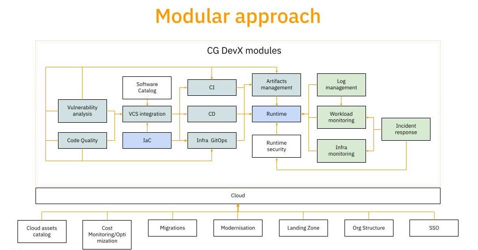

# What is CGDevX?

Welcome to CGDevX, an all-in-one platform designed to simplify and enhance the development, deployment, and management of cloud-native applications. Whether you are an experienced platform engineer or just a beginner DevOps starting your cloud-native journey, CGDevX provides the tools and capabilities to empower your team and streamline your workflows.

## Key Features

### Infrastructure as Code (IaC)

With CGDevX, you can leverage the power of Infrastructure as Code (IaC) to automate the provisioning and management of your cloud infrastructure. Define your infrastructure using simple configuration files, and CGDevX will handle the rest. Say goodbye to manual provisioning and hello to consistent, reproducible environments. CGDevX integrates seamlessly with Terraform, one of the leading IaC tools available. Terraform provides a simple, declarative language for defining and managing infrastructure resources across various cloud providers.

### Continuous Integration and Delivery (CI/CD)

CGDevX offers robust CI/CD capabilities to accelerate your software delivery lifecycle. Set up seamless pipelines to automate building, testing, and deploying your applications. Integrate with popular version control systems like Git, and choose from a range of deployment strategies such as rolling updates and canary deployments. Effortlessly deliver your applications with confidence.

### Kubernetes-based Orchestration

Harness the power of Kubernetes, the leading container orchestration platform, with CGDevX. Benefit from its scalability, resilience, and flexibility without getting bogged down by its complexities. CGDevX provides a simplified interface to deploy and manage your services, allowing you to focus on what matters most—building and running your applications.

### Observability

Gain deep insights into the health and performance of your applications with CGDevX's observability and monitoring features. Collect and analyze metrics, trace application behavior, and troubleshoot issues effectively. CGDevX integrates seamlessly with popular monitoring tools, providing real-time visibility and empowering you to make informed decisions about your systems.

### Incident Response and Automation

CGDevX streamlines incident response to ensure a quick and efficient resolution. Detect, triage, and resolve incidents with ease. Foster collaboration among team members through dedicated communication channels and easily share incident reports and updates. Leverage automated runbooks to automate repetitive tasks and improve incident response times.

### Cost Optimization

Optimize your cloud costs with CGDevX's cost management capabilities. Gain insights into resource usage, identify cost-saving opportunities, and implement effective cost-optimization strategies. Automate cleanups, enforce resource tagging and visualize cost allocation with user-friendly dashboards. Take control of your cloud spending and maximize your return on investment.

## Getting Started

Ready to dive into CGDevX? Our comprehensive documentation and guides are your go-to resource. Get started with installation, explore configuration options, discover best practices, and unlock advanced features. Join the CGDevX community to connect with other users, share knowledge, and collaborate on cloud-native development.

CGDevX empowers developers and teams to embrace cloud-native practices, supercharge their software delivery, and enhance operational efficiency. With its intuitive interface, powerful features, and extensive documentation, CGDevX is your partner on the journey to building and scaling cloud-native applications.

