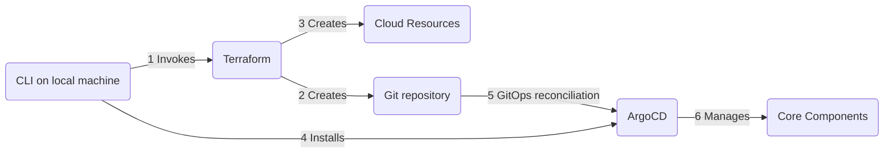

# Installation process

Installation should be done from a dedicated machine (local machine or host) that will be running the CG DevX
CLI (`cgdevxcli`) interactive tool.

With this installation approach, infrastructure is handled in terraform, and core services are handled in a GitOps way,
with ArgoCD.
When the initial installation of ArgoCD is done by the CLI, ArgoCD will self-manage its own configuration using GitOps.
Configuration management of some core services is done using terraform's capabilities.
While some users may prefer using Ansible or other tools, we find terraform well-suited for this purpose.

The main reason behind this approach is
to enable use of the same configuration with different cloud/hosting and git providers,
while retaining the ability to further customize installation without affecting reference implementation.

## Configure Cloud provider

Prepare your cloud account ([AWS](./cloud/aws_setup.md), [Azure](./cloud/azure_setup.md)).

## Configure Git Provider

Prepare your Git provider ([GitHub](./vcs/github_setup.md)).

## Get CG DevX CLI

The CG DevX CLI simplifies initial setup of the CG DevX reference architecture and further management of the platform.
The setup process is intended to be executed from an operator's machine and will create a local folder (`~/.cgdevx`)
containing tools, a
local version of GitOps repository, and configuration files.
All subsequent commands should be executed from the same machine, as they will rely on a data created by setup process.

You can allow other users to manage CG DevX installation by transferring the state file
(`state.yaml`) and certificates (`cgdevx_ed*`, `cgdevx_k8s*`) from the local folder to another machine.
Please note that this user should have the same access level to K8s cluster as one who provisioned the system.
Additional permissions and configuration changes may be required depending on authentication options
used for the cloud provider.

## Installing the CG DevX reference architecture

Once you install the CLI,
you should be able to provision a cluster using the [`setup`](./cli_commands.md#setup) command.

The CG DevX CLI tool will provide detailed information on setup process progress,
and provide you with platform user credentials.
Please store them safely.

You could get credentials by re-running the [`setup`](./cli_commands.md#setup) command on the same machine
used for installation.

Your kubeconfig file will be located in CG DevX local folder (`~/.cgdevx/kubeconfig`)

The platform GitOps repository readme file (`README.md`) will contain links to all the core services.

## Managing Workloads

Once you have a running cluster, you can create your first workload using
this [guide](../workload_management/workloads.md).
