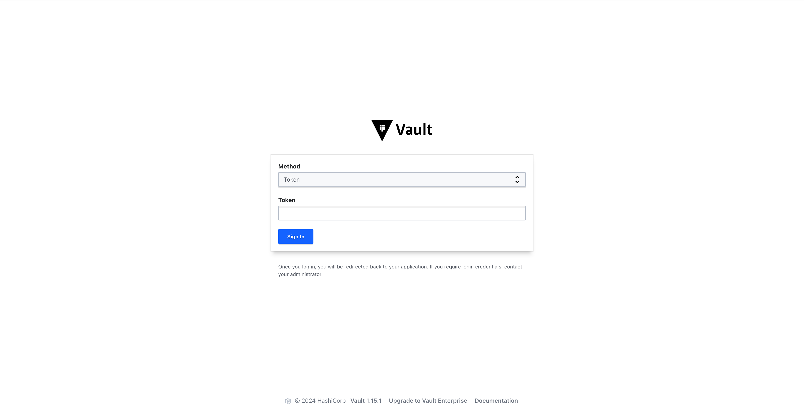
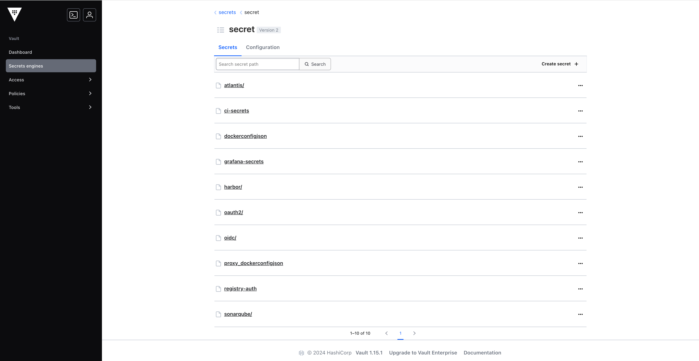

# Secrets Management

## Vault

CG DevX uses [vault](https://www.vaultproject.io/) an open source secrets manager and identity provider.

### Authentication

You could log in into Vault using platform user credentials, provided by CG DevX CLI.
You could also log in, using the root token which has full administrative permission,
but we strongly advise not using it.




Vault is also used as OIDC provider, so all other services are using it to provide SSO experience.

Initially, there will be only a singular user created that represents the CG DevX machine user account.
You could create additional accounts by updating IaC and creating a PR, more details [here](../iac/users_management.md).
You will be able to get additional user account passwords from Vault once PR is merged.

> Note, it's only possible to access user account passwords when using root token to log in.

Additional auth methods could be configured for Vault as
described [here](https://developer.hashicorp.com/vault/docs/auth)

### Kubernetes

The `external-secrets-operator` service is preconfigured with a service account that can pull secrets from Vault.
This will make secrets stored in Vault available as native Kubernetes secrets for your workload to consume.

### Secrets setup

Secrets for platform services are stored by `secrets` engine - vault kv v2 backend.



When working with K8s manifests, you could reference a secret in Vault using the following definition.
Good practice is to use `external-secrets.yaml` files.

```yaml
apiVersion: external-secrets.io/v1beta1
kind: ExternalSecret
metadata:
  name: awesome-secret
spec:
  target:
    name: awesome-secret
  secretStoreRef:
    kind: ClusterSecretStore
    name: vault-kv-secret
  refreshInterval: 10s
  dataFrom:
    - extract:
        key: secret/awesome-service/awesome-secret
```

This resource will be deployed with the service, connecting to `vault-kv-secret`, and pulling secrets from Vault to K8s.
You can pull all the key value pairs, or specify exactly which specific pairs should be pulled.