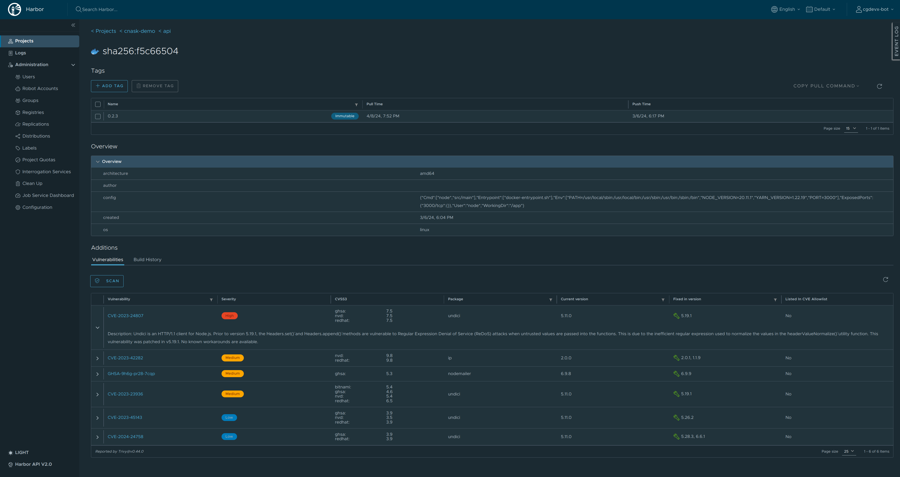
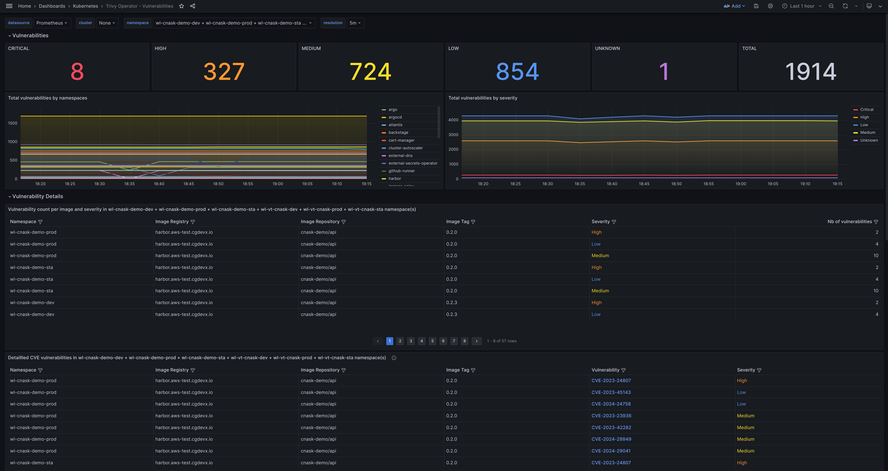
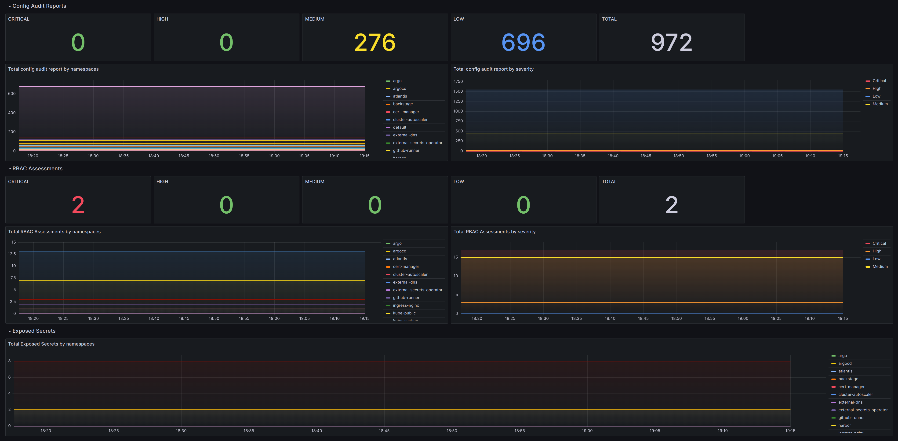

# DevSecOps

The goal is to brings together all the key elements of a security and compliance framework by embedding best practices,
policies, and tools at every stage of the delivery lifecycle, so that:

- Developers, Operators, and Security teams work together
- Security controls and visualisation is a part of delivery process
- Audit and compliance checks are in place


## Delivery pipelines

CG DevX reference implementation of delivery pipelines integrate vulnerability & misconfiguration analysis as part of
delivery pipelines.
Checks that can take place without code being executed also known as but not limited to static security.

- Provide feedback on early stages of delivery pipeline
- Help prioritise vulnerabilities
- Works with source code, dependencies, manifests, and IaC

### Vulnerability & misconfiguration checks during build time

Implemented as an additional step in CI pipelines using [Trivy](https://github.com/aquasecurity/trivy) scanner. For more
details please see [CI](../../developers_guide/ci/trivy.md)

### Image analysis

CG DevX utilizes [Harbor](https://goharbor.io/) ability to provide static analysis of vulnerabilities in images via
integration with [Trivy](https://github.com/aquasecurity/trivy) and [Clair](https://github.com/coreos/clair) scanners.

Trivy integration is turned on by default. To enable clair or turn of trivy integration you should update harbor
configuration in your platform GitOps repository  
`gitops-pipelines/delivery/clusters/cc-cluster/core-services/components/harbor/harbor.yaml`

```yaml
trivy:
  # enabled the flag to enable Trivy scanner
  enabled: false
clair:
  # enabled the flag to enable Clair scanner
  enabled: true
```

Findings should appear in harbor web portal under project => registry => image as shown in an example below.



Other scanners could be enabled through Harbor’s embedded interrogation service. For more details please
see [official documentation](https://goharbor.io/docs/2.0.0/install-config/harbor-compatibility-list/#scanner-adapters)

## Runtime

CG DevX platform reference architecture provides runtime checks - real-time analysis of workloads and core services runtime for vulnerabilities also known as dynamic security
- Continuous scanning of application, runtime, configuration (secrets, passwords, etc.)
- Focuses on live (production) workloads, runtime, and infrastructure

### Vulnerability & misconfiguration checks in runtime

Implemented using Aqua Security [Trivy operator](https://github.com/aquasecurity/trivy-operator)

Trivy operator reports are available as CRDs. For more details on CRDs please
check [Trivy documentation](https://aquasecurity.github.io/trivy-operator/latest/docs/crds/).

Trivy findings are available via `Trivy Operator - Vulnerabilities` Grafana dashboard




For more details on configuration options please
check [official documentation](https://aquasecurity.github.io/trivy-operator/latest/getting-started/installation/configuration/)

### System runtime security

Implemented using Aqua Security [Tracee](https://github.com/aquasecurity/tracee)

Tracee findings are available via `tracee-dashboard` Grafana dashboard or using kubectl logs command:

```shell
kubectl logs -f daemonset/tracee -n tracee
```

You could create policies by adding them directly to your platform GitOps repository
under `/gitops-pipelines/delivery/clusters/cc-cluster/core-services/components/devsecops/tracee/` path.
For more details please
check [official documentation](https://aquasecurity.github.io/tracee/latest/docs/policies/usage/kubernetes/)

### Policy check and enforcement

Implementation is done using [Kyverno](https://kyverno.io/) policy engine. Kyverno has the following policies installed
by default using kyverno-policies helm chart as configured in the platform GitOps
repository `/gitops-pipelines/delivery/clusters/cc-cluster/core-services/components/devsecops/kyverno/kyverno-policies.yaml`

**Baseline**

- `disallow-capabilities`
- `disallow-host-namespaces`
- `disallow-host-path`
- `disallow-host-ports`
- `disallow-host-process`
- `disallow-privileged-containers`
- `disallow-proc-mount`
- `disallow-selinux`
- `restrict-apparmor-profiles`
- `restrict-seccomp`
- `restrict-sysctls`

**Restricted**

- `disallow-capabilities-strict`
- `disallow-privilege-escalation`
- `require-run-as-non-root-user`
- `require-run-as-nonroot`
- `restrict-seccomp-strict`
- `restrict-volume-types`

You could add more policies by:

- Setting a link to existing policy from [Kyverno policies repository](https://kyverno.io/policies/)
- Adding them directly to your platform GitOps repository
  under `/gitops-pipelines/delivery/clusters/cc-cluster/core-services/components/devsecops/kyverno/` path.

Kyverno provides UI which is available via port forwarding, e.g.

```shell
kubectl port-forward service/policy-reporter-ui 8080:8080 -n kyverno
```

[Policy Reporter](https://github.com/kyverno/policy-reporter-kyverno-plugin) plugin is installed by default and provides
additional information like what policies exist in your Cluster, how they are configured and if there are any violations
associated with them.

