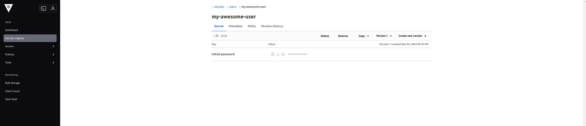
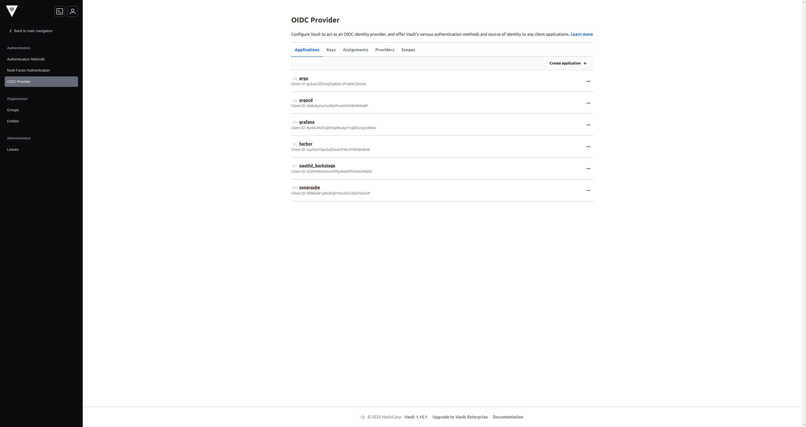

# IAM

CG DevX reference implementation attempts to standardize and simplify user identity and access management.

## Cloud services access

Roles and policies used on Cloud Provider IAM level are defined as part of cloud provider module. All the modules
implement roles for the following platform services:

- PR automation for IaC
- CI
- Cert manager
- External DNS
- Secret Manager
- Cluster Autoscaler

In addition, there could be cloud provider specific roles required by K8s plugins, or other actors.

Roles are mapped to K8s service accounts using cloud provider specific annotations using IAM roles for service
accounts (IRSA), Workload Identity, or similar mechanism, eg
`eks.amazonaws.com/role-arn`
`azure.workload.identity/client-id`

Permission scope set by default could be too wide, or narrow for your specific case. In order to adjust them you should
edit cloud provider specific implementation located in your platform GitOps repository:

- AWS `terraform/modules/cloud_aws/iam.tf`
- Azure `terraform/modules/cloud_azure/service_accounts.tf`

## User management

User management is controlled by CG DevX. This includes Git access, Vault access, and access to all core services via
OIDC, and access to workloads.  
By default, during platform setup process CG DevX CLI creates one user with admin permissions. Additional users could be
defined via IaC.

Git user management is done using Git provider specific implementation:

- **GitHub**: `terraform/modules/users_github`

[//]: # (- GitLab `terraform/modules/users_gitlab`)

Users should be defined as dictionary in platform GitOps repository `terraform/users/main.tf` as shown below.

```yaml
users            = {
  ### Primary bot user
  "cgdevx-bot" = {
  vcs_username         = local.vcs_bot_username
  email                = local.bot_email
  first_name           = "CG DevX"
  last_name            = "Bot"
  vcs_team_slugs       = ["${local.gitops_repo_name}-admins"]
  acl_policies         = ["admin", "default"]
  oidc_groups_for_user = ["admins"]
  },
  ### Additional users defined bellow. Use this as an example
  "my-awesome-user" = {
  vcs_username   = "git user slug"
  email             = "user email"
  first_name        = "First"
  last_name         = "Last"
  vcs_team_slugs = ["git team slugs", "demo-workload-developers"]
  acl_policies      = ["developers", "default", "workload-name-role", "demo-workload-admins"]
  oidc_groups_for_user = ["developers", "demo-workload-admins"]
  },
}
```

When PR introducing new users is applied via Atlantis, user password for accessing Vault and other platform core
services through Vault, will be stored to Vault. You should use root token to access password, and distribute them to
the end users.



## OIDC and SSO

Vault is used as OIDC provider enabling SSO experience for platform users. Configuration is done using
IaC `terraform/modules/secrets_vault/oidc-clients.tf` and done during platform provisioning.

- Argo Workflow
- Argo CD
- Grafana
- Harbor
- SonarQube
- Backstage



Following scopes are provided via OIDC and could be changed via IaC `terraform/modules/secrets_vault/oidc-scopes.tf`

- email
- groups
- profile
- user

Permissions across all core services are mapped using `groups` scope.

### Vault

Access control is done using groups. CG DevX reference implementation has two default groups:

- admins
- developers

Those two groups have platform wide access. For each workload CG DevX creates the same two groups scoped to a workload
using `<workload-name>-<group-name>` pattern.

Admins group policy:

```hcl
# Create and manage entities and groups
path "identity/*" {
  capabilities = ["create", "read", "update", "delete", "list"]
}

# Configure the OIDC auth method
path "auth/*" {
  capabilities = ["create", "read", "update", "delete", "list"]
}

# Write ACL policies
path "sys/policies/acl/*" {
  capabilities = ["create", "read", "update", "delete", "list"]
}

# Allow default access to secret
path "secret/*" {
  capabilities = ["create", "read", "update", "delete", "list"]
}

# Allow full access to workloads secrets
path "workloads/*" {
  capabilities = ["create", "read", "update", "delete", "list"]
}

# allow admins to manage mounts
path "sys/mounts/*" {
  capabilities = ["create", "read", "update", "delete", "list"]
}

# List enabled secrets engine
path "sys/mounts" {
  capabilities = ["read", "list"]
}

# allow admins to manage auth methods
path "/sys/auth*" {
  capabilities = ["create", "read", "update", "delete", "list", "sudo"]
}

# allow admins to manage auth methods
path "sys/auth/*" {
  capabilities = ["create", "read", "update", "delete", "list"]
}
```

Developers group policy:

```hcl
# Allow full write access to platform developers, without delete
path "secret/*" {
  capabilities = ["create", "read", "update", "list"]
}

# Allow write access to workloads secrets
path "workloads/*" {
  capabilities = ["create", "read", "update", "list"]
}

# List available secrets engines to retrieve accessor ID
path "sys/mounts" {
  capabilities = ["read"]
}
```

Policies could be edited via `terraform/modules/secrets_vault/policies.tf`

### Argo Workflows

CG DevX reference implementation has the following Argo Workflow group mapping:

| CG DevX role        | Argo Workflows role           |
|---------------------|-------------------------------|
| Platform admins     | All project admins            |
| Platform developers | All project developers        |
| Workload admins     | Workload Namespace admins     |
| Workload developers | Workload Namespace developers |

Mapping is configured via Argo Workflow ServiceAccounts
`gitops-pipelines/delivery/clusters/cc-cluster/core-services/components/argo-workflows/sa-argo.yaml`

### Argo CD

CG DevX reference implementation has the following Argo CD group mapping:

| CG DevX role        | Argo CD role          |
|---------------------|-----------------------|
| Platform admins     | All project admins    |
| Platform developers | All project read-only |
| Workload admins     | Project full-access   |
| Workload developers | Project read-only     |

Mapping is configured via Argo CD
ConfigMap `gitops-pipelines/delivery/clusters/cc-cluster/core-services/components/argocd/argocd-rbac-cm.yaml`

### Harbor

CG DevX reference implementation has the following Harbor group mapping:

| CG DevX role        | Harbor role        |
|---------------------|--------------------|
| Platform admins     | Harbor admins      |
| Platform developers | Harbor guest       |
| Workload admins     | Project maintainer |
| Workload developers | Project developer  |

Mapping is configured via IaC `terraform/modules/registry_harbor/project/main.tf`

```hcl
resource "harbor_project_member_group" "platform_developers" {
  project_id = harbor_project.this.id
  group_name = "developers"
  role       = "guest"
  type       = "oidc"
}

resource "harbor_project_member_group" "workload_developers" {
  project_id = harbor_project.this.id
  group_name = "${var.project_name}-developers"
  ##choose correct role for workload developers from projectadmin, maintainer(master), developer, guest, limited guest
  ## https://goharbor.io/docs/2.0.0/administration/managing-users/user-permissions-by-role/
  role       = "developer"
  type       = "oidc"
}

resource "harbor_project_member_group" "workload_admins" {
  project_id = harbor_project.this.id
  group_name = "${var.project_name}-admins"
  role       = "maintainer"
  type       = "oidc"
}
```

### SonarQube

CG DevX reference implementation has the following SonarQube group mapping:

| CG DevX role        | Harbor role                                                 |
|---------------------|-------------------------------------------------------------|
| Platform admins     | SonarQube admins                                            |
| Platform developers | GateAdmin, Scan                                             |
| Workload admins     | Project admins                                              |
| Workload developers | Project: CodeViewer, IssueAdmin, Scan, SecurityHotSpotAdmin |

OIDC configuration `terraform/modules/code_quality_sonarqube/oidc.tf`

Group mapping `terraform/modules/code_quality_sonarqube/groups.tf`

```hcl
resource "sonarqube_group" "admins" {
  name        = "admins"
  description = "This is a vault admin group"
}

resource "sonarqube_group" "developers" {
  name        = "developers"
  description = "This is a vault developers group"
}

resource "sonarqube_permissions" "admins" {
  depends_on  = [sonarqube_group.admins]
  group_name  = "admins"
  permissions = ["admin"]
}

# Valid values are [admin, gateadmin, profileadmin, provisioning, scan]
# incorrect documentation here https://registry.terraform.io/providers/jdamata/sonarqube/latest/docs/resources/sonarqube_permissions
resource "sonarqube_permissions" "developers" {
  depends_on  = [sonarqube_group.developers]
  group_name  = "developers"
  permissions = ["gateadmin", "scan"]
}
```

Workload group mapping `terraform/modules/code_quality_sonarqube/project/main.tf`

```hcl
resource "sonarqube_group" "workload_admins" {
  name        = "${var.project_name}-admins"
  description = "This is a ${var.project_name} admin group"
}

resource "sonarqube_group" "workload_developers" {
  name        = "${var.project_name}-developers"
  description = "This is a ${var.project_name} developers group"
}

resource "sonarqube_permissions" "workload-admins" {
  group_name  = "${var.project_name}-admins"
  project_key = sonarqube_project.this.project
  permissions = ["admin"]
  depends_on  = [sonarqube_group.workload_admins]
}

resource "sonarqube_permissions" "workload-developers" {
  group_name  = "${var.project_name}-developers"
  project_key = sonarqube_project.this.project
  permissions = ["codeviewer", "issueadmin", "scan", "securityhotspotadmin"]
  depends_on  = [sonarqube_group.workload_developers]
}
```
