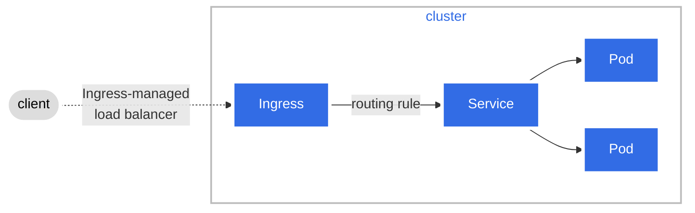

# Networking

## Network topology

CG DevX reference implementation uses tree subnets:

- **public**: contains load balancers
- **internal**:
- **private**: designated to contain K8s cluster(s), out of cluster workload resources, etc

When possible there is a direct connection / link between private subnet containing K8s cluster and Blob storage used
for terraform state, and cloud native key management solution used for K8s worker node volumes and Vault encryption.

`10.0.0.0/16` IPv4 CIDR block address range is used by default. Range is split equally between subnets.

Network implementation is cloud provider specific and described in:

- **AWS**: `terraform/modules/cloud_aws/vpc.tf`
- **Azure**: `terraform/modules/cloud_azure/network.tf`

## DNS management

DNS management is done using [external DNS](https://kubernetes-sigs.github.io/external-dns/) controller. It synchronizes
exposed Kubernetes Services and Ingresses with DNS providers. Configuration is done using manifest located in platform
GitOps
repository `gitops-pipelines/delivery/clusters/cc-cluster/core-services/components/kube-system/external-dns/application.yaml`

Currently, only cloud provider native implementation is supported

- **AWS**: Route53
- **Azure**: Azure DNS
- **GCP**: Cloud DNS

## Ingress

CG DevX uses [Ingress NGINX Controller](https://kubernetes.github.io/ingress-nginx/). SSL passthrough is enabled to
allow SSL termination in a specific service.

Configuration is done using manifest located in platform GitOps
repository `gitops-pipelines/delivery/clusters/cc-cluster/core-services/components/kube-system/ingress-nginx/application.yaml`

